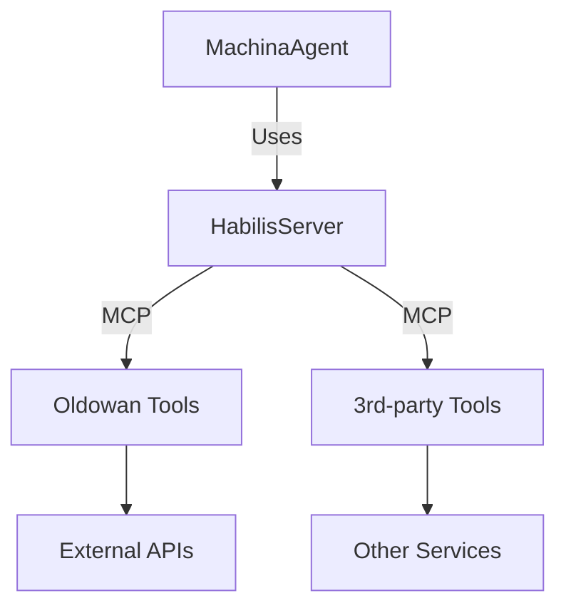
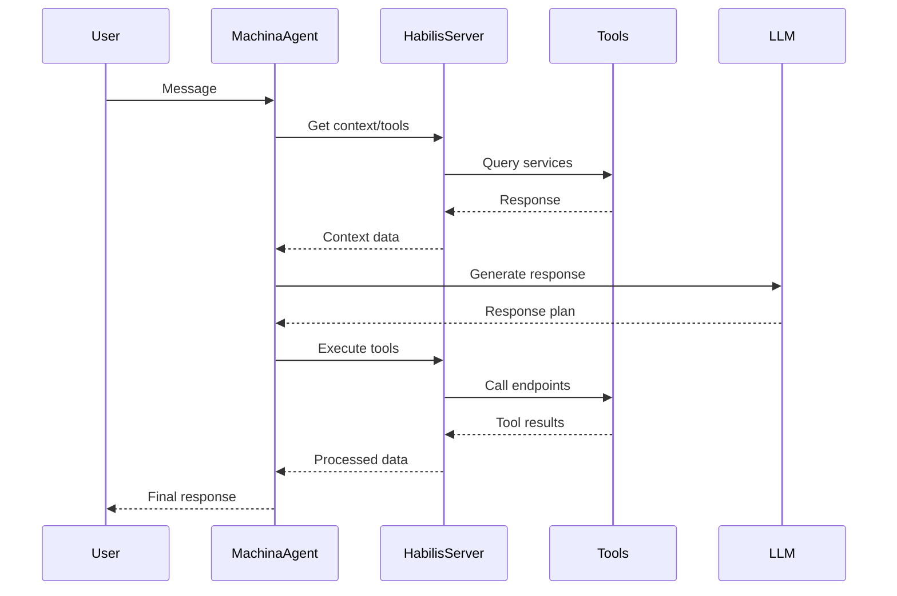

# Machina Habilis 🛠️ - TypeScript Framework for Tool-Using Autonomous Agents

**Machina Habilis** is an evolutionary step in AI agent development - a TypeScript framework enabling sophisticated tool usage through the Model Context Protocol (MCP). Named after the Homo Habilis, humanity's first tool-using species, it comprises two core components:

1. **🪨 @elite-agents/oldowan** - Foundational tool server implementation
2. **🛠️ @elite-agents/habilis** - Advanced agent framework with:
   - `HabilisServer`: Infrastructure layer for tool management
   - `MachinaAgent`: Cognitive layer for conversation handling



## Features

- **Layered Architecture**  
  Clear separation between infrastructure (HabilisServer) and cognition (MachinaAgent)
- **Distributed Tool Ecosystem**  
  Discover/use tools across multiple MCP servers
- **Secure Protocol**  
  End-to-end encrypted tool communications
- **Multi-Model Runtime**  
  OpenAI, Anthropic, Local LLM support

## Core Components

### `@elite-agents/machina-habilis` (Agent Framework)

```bash
bun add @elite-agents/machina-habilis
```

- **HabilisServer** - Infrastructure service layer:
  - Manages MCP connections
  - Catalogs available tools
  - Handles cross-server communication
- **MachinaAgent** - Cognitive conversation layer:
  - LLM interaction pipelines
  - Contextual memory management
  - Persona-driven behavior

### `@elite-agents/oldowan` (Tool Server)

```bash
bun add @elite-agents/oldowan
```

- MCP-compliant tool servers
- Automatic validation & security
- Zero-config proxy setup

## Quick Start

1. **Create Agent**:

```typescript
import { MachinaAgent, HabilisServer } from '@elite-agents/habilis';
import { Keypair } from '@solana/web3.js';

const habilisServer = new HabilisServer('http://localhost:8080'); // Memory server

await habilisServer.init(['http://localhost:8888', 'http://localhost:9999']); // Tool servers

const agent = new MachinaAgent(habilisServer, {
  persona: {
    name: 'Research Assistant',
    bio: ['Knowledge-focused', 'Detail-oriented'],
  },
  abilityNames: ['web_search'],
  llm: {
    provider: 'openai',
    name: 'gpt-4',
    apiKey: 'sk-your-key',
  },
  keypair: Keypair.generate(),
});
```

2. **Use Your Agent**:

```typescript
const response = await agent.message("What's the weather in Nairobi?", {
  channelId: 'weather-requests',
});

console.log(response.output);
```

## Architecture Overview

### Component Roles

**HabilisServer**

- Infrastructure backbone
- Tool discovery/registration
- Cross-server coordination
- Shared memory services

**MachinaAgent**

- User interaction interface
- LLM reasoning pipelines
- Contextual conversation state
- Persona enforcement

### Operational Flow



## Why Habilis?

1. **Evolutionary Architecture**  
   Clear separation between infrastructure and cognition layers

2. **Distributed Cognition**  
   Tools remain decoupled from agent core

3. **Protocol-first Design**  
   MCP enables cross-platform interoperability

4. **Secure Foundation**  
   Crypto-native identity & permissions

## License

MIT © [Elite Agents](https://github.com/elite-agents)
