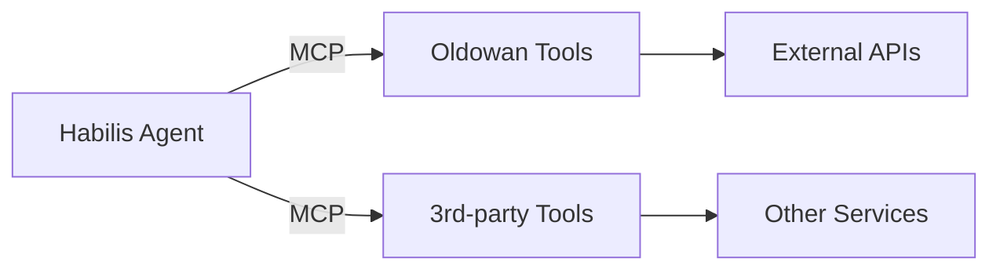

# Habilis 🛠️ - TypeScript Framework for Tool-using Autonomous Agents

**Habilis** is an evolutionary step in AI agent development - a TypeScript framework enabling sophisticated tool usage through the Model Context Protocol (MCP). Named after humanity's first tool-making species, it comprises two core libraries:

1. **🪨 @elite-agents/oldowan** - Foundational tool server implementation
2. **🛠️ @elite-agents/habilis** - Advanced agent framework



## Features

- **Cognitive Architecture**  
  Context-aware agents with episodic memory
- **Tool Ecosystem**  
  Discover/use tools across multiple MCP servers
- **Secure Protocol**  
  End-to-end encrypted tool communications
- **Multi-Model Runtime**  
  OpenAI, Anthropic, Local LLM support
- **TypeSafe Development**  
  Full TypeScript validation across toolchain

## Core Packages

### `@elite-agents/habilis` (Agent Framework)

```bash
bun add @elite-agents/habilis
```

- Autonomous agent core with tool orchestration
- Dynamic persona/identity system
- Contextual memory management
- Multi-server tool discovery

### `@elite-agents/oldowan` (Tool Server)

```bash
bun add @elite-agents/oldowan
```

- MCP-compliant tool servers
- Automatic validation & security
- Zero-config proxy setup
- Tool version management

## Quick Start

1. **Create Tool Service** (Oldowan):

```typescript
// weather.service.ts
import { OldowanTool } from '@elite-agents/oldowan';

export const weatherTool = new OldowanTool({
  name: 'get_weather',
  execute: ({ location }) => ({ temp: 22, location }),
});
```

2. **Create Agent** (Habilis):

```typescript
// research-agent.ts
import { Habilis } from '@elite-agents/habilis';

const agent = await Habilis.create('http://memory-service', {
  abilities: [
    {
      name: 'weather',
      abilityServer: 'http://tool-service:3000',
    },
  ],
});

const response = await agent.message("What's the weather in Nairobi?", {
  channelId: 'weather-requests',
});
```

## Architecture

**Habilis Agent Stack**

```
  Agent Persona
      │
      ▼
  Cognitive Layer
      │
      ▼
  Tool Orchestrator ◄──┐
      │               │
      ▼               │
  MCP Protocol ───────┘
      │
      ▼
  [Oldowan | 3rd-party Tools]
```

## Why Habilis?

1. **Evolutionary Tool Use**  
   Agents adapt tool usage strategies based on context

2. **Distributed Cognition**  
   Tools remain decoupled from agent core

3. **Protocol-first**  
   MCP enables cross-platform interoperability

4. **Secure Foundation**  
   Crypto-native identity & permissions

## License

MIT © [Elite Agents](https://github.com/elite-agents)
