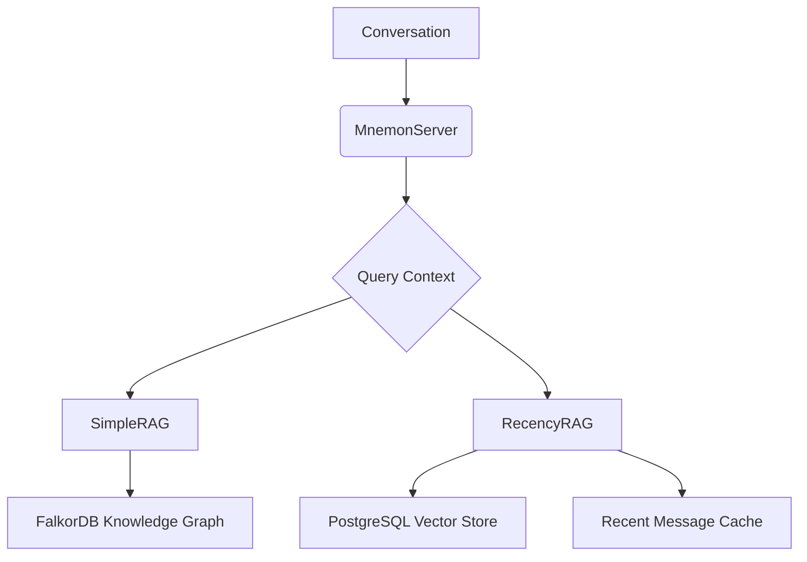

# @elite-agents/mnemon

Advanced memory management system combining vector search and knowledge graph capabilities for conversational AI systems. Inspired by the [Daemon Framework](https://daemon.spacemangaming.com/).

## Features

- **Dual RAG Architecture**:
  - **SimpleRAG**: Entity/relationship extraction with FalkorDB knowledge graph
  - **RecencyRAG**: Vector similarity search with temporal relevance using PostgreSQL
- **Contextual Memory**:
  - Automatic entity/relationship extraction from conversations
  - Short-term message recall with semantic search
  - Long-term knowledge graph persistence
- **AI Integration**:
  - OpenAI-compatible embedding models
  - Configurable LLM models for entity extraction
- **Multi-tenancy Support**:
  - Agent-specific memory isolation
  - Channel-based context segmentation

## Installation

```bash
bun add @elite-agents/mnemon
```

## Configuration

```typescript
import { MnemonServer } from '@elite-agents/mnemon';

// AI Configuration
const aiConfig = {
  apiKey: process.env.OPENAI_API_KEY,
  baseUrl: 'https://api.openai.com/v1',
  entityExtractionModel: 'gpt-4o',
  embeddingModel: 'text-embedding-3-small',
  vectorDimensions: 1536,
};

// FalkorDB Configuration
const falkorConfig = {
  password: 'your-falkordb-password',
  socket: {
    host: 'localhost',
    port: 6379,
  },
  graph: 'conversation_graph',
};

// PostgreSQL Configuration
const postgresConfig = {
  host: 'localhost',
  port: 5432,
  user: 'postgres',
  password: 'postgres',
  database: 'message_store',
};

const mnemon = new MnemonServer();
await mnemon.init(aiConfig, falkorConfig, postgresConfig);
```

## Usage

```typescript
const oldowanServer = await mnemon.getProxy();

Bun.serve({
  ...oldowanServer,
  idleTimeout: 255,
});
```

## API Overview

### Core Methods

- `init(aiConfig, falkorConfig, postgresConfig)`: Initialize connections
- `getContextFromQuery(lifecycle)`: Retrieve relevant context
- `insertKnowledge(lifecycle)`: Store conversation knowledge

### Tools

1. **GET_CONTEXT_FROM_QUERY_TOOL**

   - Combines results from:
     - Knowledge graph entity matches
     - Vector search of recent messages
     - Temporal message recall

2. **INSERT_KNOWLEDGE_TOOL**
   - Stores information in:
     - Knowledge graph (entities/relationships)
     - Vector database (message embeddings)
     - Temporal message store

## Architecture



## Dependencies

- **FalkorDB**: For knowledge graph storage
- **PostgreSQL**: For vector embeddings and temporal storage
- **AI Providers**: OpenAI-compatible API endpoints

## Troubleshooting

Common Issues:

1. **Database Connections**:

   - Verify FalkorDB/PostgreSQL credentials
   - Check database permissions

2. **Vector Dimensions**:

   - Ensure configured dimensions match embedding model output

3. **AI Models**:
   - Verify API keys and base URLs
   - Check model availability

## License

MIT
